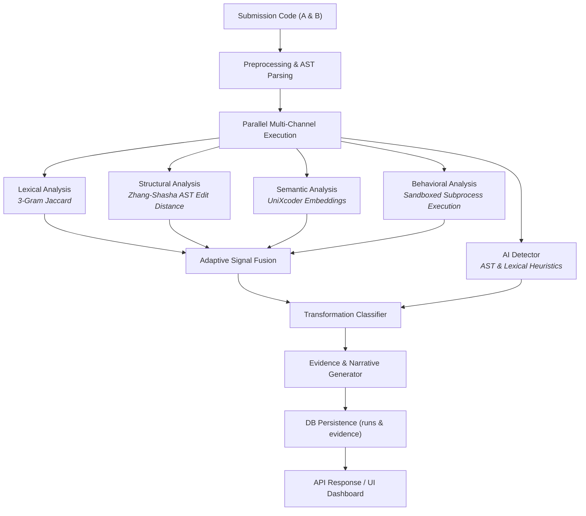
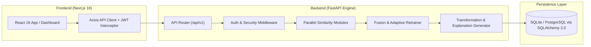

# EHSA — Explainable Hybrid Similarity Analyzer

> An evidence-first Python source-code similarity investigation platform combining multi-channel signal analysis, explainable evidence generation, and adaptive feedback fusion.

---

## Overview

Traditional code similarity detectors rely either on brittle lexical token matching or opaque "black-box" neural embeddings that produce similarity scores without traceable evidence. **EHSA (Explainable Hybrid Similarity Analyzer)** addresses this challenge through an **evidence-first** architecture.

Instead of providing a single unexplainable number, EHSA evaluates code across four independent analysis channels—**Lexical**, **Structural**, **Semantic**, and **Behavioral**—and pairs every score with fine-grained, inspectable evidence (such as shared $N$-grams, AST subtree edits, contextual embedding cosine distances, and dynamic execution outputs).EHSA integrates a closed-loop **Adaptive Fusion Engine** that refits feature weights via $L_2$-penalized Logistic Regression based on explicit instructor feedback (`confirmed` vs. `false_positive` verdicts).

---

## Key Capabilities

- **Multi-Channel Signal Extraction**:
  - **Lexical Channel**: 3-gram multiset Jaccard ratio on tokenized source code.
  - **Structural Channel**: Python Abstract Syntax Tree (AST) parsing with Zhang-Shasha (`zss`) tree edit distance.
  - **Semantic Channel**: Contextual code embeddings using Hugging Face UniXcoder (`microsoft/unixcoder-base`) with L2-normalized mean-pooling.
  - **Behavioral Channel**: Sandboxed subprocess execution evaluating functional output equivalence across test cases under strict memory (128 MB) and time (2.0s) constraints.
- **Explainable Evidence Generation**:
  - Transparent evidence payloads persisted directly to the database alongside run scores.
  - Automatic detection of transformation types (*Exact Copy*, *Variable Renaming*, *Structural Refactoring*, *Likely AI Rewrite*, *Partial Match*, *Unrelated*).
  - Rule-based AI-generation heuristics inspecting AST docstring density, type annotations, identifier lengths, and token entropy.
- **Adaptive Weight Fusion**:
  - Dynamically renormalizes weights when individual signals (e.g., behavioral or semantic) are absent ($None \neq 0.0$).
  - Admin-triggered adaptive retraining refitting weights from historical feedback entries.
- **Batch Comparison**:
  - Pairwise $\mathcal{O}(N^2)$ matrix evaluation accepting up to 20 uploaded Python files (`POST /api/v1/compare/batch`).
- **Security & Privacy**:
  - PBKDF2-HMAC-SHA256 password hashing (600,000 iterations) and signed HS256 JWT tokens.
  - Role-Based Access Control (`user`, `admin`), IDOR protection across run endpoints, and thread-safe sliding-window rate limiting.
  - Guest isolation mode allowing guest analyses to run without leaking data to registered accounts.
- **Report Export**:
  - Downloadable investigation reports in HTML and structured JSON formats.

---

## How EHSA Works

EHSA processes input code pairs through a multi-stage sequential pipeline:



### Analysis Signal Overview

| Signal | Primary Method | Purpose | Evidence Output |
|---|---|---|---|
| **Lexical** | 3-gram Multiset Jaccard | Surface-level token overlap | Top matched $N$-grams & occurrence counts |
| **Structural** | Zhang-Shasha (`zss`) AST Tree Edit Distance | Program control flow & node shape | Subtree node match & divergence counts |
| **Semantic** | UniXcoder Mean-Pooled Cosine Distance | Conceptual & algorithmic intent | Embedding cosine value & truncation disclosure |
| **Behavioral** | Sandboxed Execution Subprocess | Functional runtime equivalence | Per-input stdout, stderr & match status |
| **AI Detector** | AST & Lexical Heuristics | AI rewrite likelihood | Feature density breakdown (types, docstrings, etc.) |

---

## High-Level Architecture

The system is structured as a decoupled client-server architecture:



- **Frontend**: Next.js 16 (App Router), React 19, TailwindCSS, Axios client with JWT authorization interceptors.
- **Backend**: FastAPI async web application, SQLAlchemy 2.0 ORM, PyTorch CPU inference, scikit-learn.
- **Database**: SQLite (`ehsa.db` via `sqlite+aiosqlite`) for local development; PostgreSQL compatible via `DATABASE_URL`.

---

## Technology Stack

| Component | Technology | Version / Specification |
|---|---|---|
| **Backend Framework** | FastAPI | `≥ 0.100.0` |
| **Async Runtime** | Uvicorn / asyncio | Python 3.10+ |
| **ORM & Database** | SQLAlchemy 2.0 / aiosqlite | SQLite / PostgreSQL |
| **Structural Engine** | Python `ast` + `zss` | Zhang-Shasha Tree Edit Distance |
| **Semantic Model** | Hugging Face Transformers + PyTorch | `microsoft/unixcoder-base` |
| **Adaptive ML** | scikit-learn | `LogisticRegression(penalty="l2")` |
| **Frontend Framework** | Next.js / React | Next.js 16 / React 19 |
| **Styling** | TailwindCSS | Modern dark/light glassmorphic UI |
| **Auth & Security** | PyJWT / Passlib / hashlib | HS256 JWT, PBKDF2-HMAC-SHA256 |

---

## Repository Structure

```
EHSA/
├── backend/
│   ├── app/
│   │   ├── api/             # FastAPI route handlers (/analyze, /compare/batch, /auth, etc.)
│   │   ├── auth/            # JWT validation, security helpers, rate limiting
│   │   ├── db/              # SQLAlchemy 2.0 models & async session factory
│   │   ├── explain/         # Transformation classifier, AI detector, narrative builder
│   │   ├── fusion/          # Fixed-weight & adaptive fusion retraining engine
│   │   ├── preprocessing/   # AST parser & code tokenizer
│   │   ├── similarity/      # Lexical, Structural, Semantic, Behavioral modules
│   │   └── main.py          # FastAPI application entry point
│   ├── tests/               # Pytest unit and integration test suite (260 tests)
│   └── requirements.txt     # Python backend dependencies
├── frontend/
│   ├── src/
│   │   ├── app/             # Next.js App Router pages (/dashboard, /history, /batch, etc.)
│   │   ├── components/      # Reusable UI components (ScoreCard, EvidencePanel, etc.)
│   │   └── lib/             # API client & authentication context
│   └── package.json         # Frontend Node.js dependencies
├── experiments/             # Benchmark datasets, evaluation scripts & statistical tests
├── docs/                    # Public architecture documents & system diagrams
├── .env.example             # Safe environment configuration template
├── .gitignore               # Production git ignore configuration
├── docker-compose.yml       # Docker compose orchestration
└── README.md                # Project documentation
```

---

## System Requirements

- **Python**: `3.10` or higher (tested on Python `3.13.5`)
- **Node.js**: `18.0.0` or higher
- **Docker**: Docker Desktop / Docker Engine (optional, for containerized run)

---

## Quick Start

### 1. Run with Docker (Recommended)

To launch the full backend, frontend, and database automatically:

```bash
# Clone repository
git clone https://github.com/Dhammdip-Lokhande1/ESHA-PROJECT.git
cd ESHA-PROJECT

# Start container stack
docker compose up --build
```

Access services at:
- **Frontend App**: `http://localhost:3000`
- **Backend API**: `http://localhost:8000`
- **Interactive API Docs (Swagger)**: `http://localhost:8000/docs`

---

## Local Development (Without Docker)

### Backend Setup

```bash
cd backend

# Create & activate virtual environment
python -m venv .venv

# Windows (PowerShell):
.\.venv\Scripts\Activate.ps1
# Linux/macOS:
source .venv/bin/activate

# Install dependencies
pip install -r requirements.txt

# Copy environment template
cp ../.env.example .env

# Initialize database schema and start server
uvicorn app.main:app --reload --port 8000
```

### Frontend Setup

```bash
cd frontend

# Install Node dependencies
npm install

# Start Next.js development server
npm run dev
```

### Automated Backend Tests

```bash
# Run backend test suite (255 unit/integration tests)
python -m pytest backend/tests
```

---

## Environment Configuration

Copy `.env.example` to `.env` in your local setup and adjust variables:

| Variable | Default Value | Description |
|---|---|---|
| `DATABASE_URL` | `sqlite+aiosqlite:///./ehsa.db` | Database connection string (SQLite / PostgreSQL) |
| `MODEL_NAME` | `microsoft/unixcoder-base` | Hugging Face model for semantic similarity |
| `CORS_ORIGINS` | `http://localhost:3000` | Allowed origin header for FastAPI CORS |
| `MAX_FILE_SIZE_BYTES` | `1048576` | Maximum allowed submission file size (1 MB) |
| `BEHAVIORAL_TIMEOUT_SECONDS` | `2.0` | Maximum subprocess execution time limit |
| `BEHAVIORAL_MAX_MEMORY_BYTES` | `134217728` | Maximum subprocess memory limit (128 MB) |
| `AI_GENERATION_THRESHOLD` | `0.65` | AI rewrite transformation trigger threshold |
| `SECRET_KEY` | `CHANGE_ME_TO_A_RANDOM_SECRET` | Cryptographic secret for signing JWT tokens |
| `INITIAL_ADMIN_USERNAME` | `admin` | Initial admin username on first startup |
| `INITIAL_ADMIN_EMAIL` | `admin@ehsa.local` | Initial admin email address |
| `INITIAL_ADMIN_PASSWORD` | `CHANGE_ME_TO_A_SECURE_PASSWORD` | Initial admin password on startup |
| `NEXT_PUBLIC_API_BASE_URL` | `http://localhost:8000` | Backend API base URL for frontend client |

---

## Authentication & Access Control

EHSA uses server-enforced Role-Based Access Control (RBAC):

- **`user`**: Can submit code for analysis (`/analyze`, `/compare/batch`), view personal history, export reports, and claim guest runs. Cannot access aggregate analytics or trigger weight retraining.
- **`admin`**: Full system permissions, including User Management (`/api/v1/admin/users`), assigning roles, viewing aggregate class metrics, and triggering adaptive fusion retraining (`POST /api/v1/fusion/retrain`).

---

## Core API Endpoints Overview

| Method | Endpoint | Access Level | Description |
|---|---|---|---|
| `POST` | `/api/v1/analyze` | Public / Guest | Analyze two Python source files and return fused similarity & evidence |
| `POST` | `/api/v1/compare/batch` | Public / Guest | Perform pairwise $\mathcal{O}(N^2)$ matrix comparison for up to 20 files |
| `POST` | `/api/v1/feedback/{run_id}` | Authenticated | Submit instructor verdict (`confirmed` or `false_positive`) |
| `GET` | `/api/v1/runs` | Authenticated | List analysis runs for authenticated user |
| `POST` | `/api/v1/runs/{run_id}/claim` | Authenticated | Claim an unassigned guest run into personal user history |
| `GET` | `/api/v1/report/{run_id}` | Authenticated | Download investigation report (HTML or JSON format) |
| `GET` | `/api/v1/fusion/weights` | Public | Inspect active fusion weights and retraining audit history |
| `POST` | `/api/v1/fusion/retrain` | Admin Only | Trigger adaptive fusion weight retraining on historical feedback |
| `POST` | `/api/v1/auth/register` | Public | Register a new user account |
| `POST` | `/api/v1/auth/login` | Public | Authenticate user and receive JWT bearer token |

Full OpenAPI specification is available interactively at `/docs`.

---

## Research & Benchmark Reproducibility

The repository includes a dedicated benchmark suite for evaluating similarity detection under zero-leakage conditions (`experiments/` directory):

- **Research Benchmark**: 180 synthetic code pairs across 30 source algorithm families (Exact Copy, Variable Renaming, Structural Refactoring, AI Rewrite, Unrelated, Hard Negatives).
- **CodeNet Subset**: 100-pair controlled subset from IBM CodeNet Python 800.
- **Evaluation Protocols**: 5-Fold Grouped Cross-Validation (grouped by source program ID to prevent data leakage).

To run evaluation scripts:

```bash
# Generate research benchmark dataset
python -m experiments.build_research_dataset

# Run statistically fair evaluation protocol
python -m experiments.evaluate_fair

# Run 15-channel ablation study
python -m experiments.ablation_cv

# Run statistical significance tests (McNemar & Paired Bootstrap AUC)
python -m experiments.stats_tests
```

---

## Security Considerations

- **Secret Management**: Never commit `.env` or hardcode JWT signing keys. Set `SECRET_KEY` and `INITIAL_ADMIN_PASSWORD` via environment variables before deploying.
- **Sandbox Isolation**: Behavioral execution runs code in isolated subprocesses. On Unix platforms, `resource` limits enforce hard memory caps. Dangerous builtins (`eval`, `exec`, `open`, `__import__`) and system modules (`os`, `subprocess`, `socket`) are blocked via static AST analysis prior to execution.
- **Database Safety**: The development database `ehsa.db` is strictly untracked.

---

## Technical Limitations

1. **Target Language**: EHSA currently targets Python source code (AST parsing and tokenizers are Python-specific).
2. **Transformer Input Limits**: The UniXcoder model enforces a 512-token sequence limit. Files exceeding 512 tokens are truncated at the embedding layer; truncation disclosures are explicitly attached to the evidence payload.
3. **Platform-Specific Behavioral Enforcement**: Memory limit enforcement via `resource.RLIMIT_AS` is available on Unix/Linux platforms; on Windows, timeout limits are enforced.

---

## License & Citation

- **License**: Not yet specified.
- **Project Status**: Active open-source engineering & research codebase.
