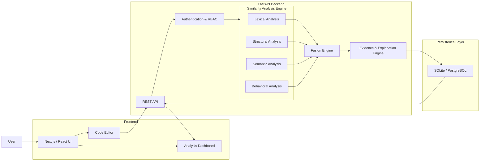

# EHSA — Explainable Hybrid Similarity Analyzer

EHSA (Explainable Hybrid Similarity Analyzer) is a source-code similarity analysis platform designed to compare Python programs using multiple complementary signals.

Instead of relying on a single similarity technique, EHSA combines **lexical, structural, semantic, and behavioral analysis** and provides supporting evidence for the resulting similarity assessment.

The platform provides a web-based interface, REST API, authentication, role-based access control, batch comparison, adaptive fusion, and explainable analysis reports.

---

## Features

- Compare two Python programs for similarity
- Analyze source code using multiple similarity channels
- Lexical similarity analysis (3-gram multiset Jaccard matching)
- Structural similarity using Python AST (Zhang-Shasha tree edit distance)
- Semantic similarity using UniXcoder embeddings (`microsoft/unixcoder-base`)
- Behavioral comparison through sandboxed execution
- Transformation-type detection (*Exact Copy*, *Variable Renaming*, *Structural Refactoring*, *Likely AI Rewrite*, *Partial Match*, *Unrelated*)
- Evidence-based similarity reports
- Batch comparison of multiple Python files ($\mathcal{O}(N^2)$ matrix evaluation)
- Adaptive fusion using instructor feedback
- User authentication and role-based access control (`user`, `admin`)
- Guest analysis support with isolated run history
- Analysis history and run claiming
- HTML and JSON report export
- REST API with interactive Swagger documentation (`/docs`)
- Docker-based deployment
- Local development support

---

## How EHSA Works

EHSA analyzes source-code pairs through several independent channels.

### 1. Lexical Analysis

The lexical analyzer compares the surface-level representation of source code.

It examines token and $N$-gram patterns to identify similarities such as:

- Shared code fragments
- Similar token sequences
- Repeated structures
- Variable and syntax patterns

---

### 2. Structural Analysis

The structural analyzer parses Python programs into Abstract Syntax Trees (ASTs).

It compares the structure of the programs rather than only their textual representation.

This helps identify similarities when code has been modified through:

- Variable renaming
- Code rearrangement
- Refactoring
- Structural transformations

EHSA uses tree-based comparison techniques (Zhang-Shasha tree edit distance) to analyze AST structure.

---

### 3. Semantic Analysis

The semantic channel uses a pretrained code representation model to compare the meaning and context of source code.

EHSA uses:

`microsoft/unixcoder-base`

This allows the system to detect similarities even when the source code has undergone substantial textual changes.

---

### 4. Behavioral Analysis

The behavioral analyzer executes compatible Python programs in controlled subprocess environments.

It compares execution results across test inputs to identify functional similarities.

Execution controls include:

- Execution timeout (2.0s default limit)
- Memory restrictions where supported (128 MB cap on Unix platforms)
- Restricted execution environment
- Static checks before execution (AST import filtering and builtin function blocking)

Behavioral analysis is used as an additional signal rather than as the only similarity measure.

---

### 5. Evidence Generation

EHSA does not only produce a similarity value.

The system collects supporting evidence from the individual analysis channels.

Examples include:

- Matching lexical patterns
- AST structural information
- Semantic similarity information
- Execution results
- Transformation indicators

This evidence is stored with the corresponding analysis run and can be displayed through the frontend.

---

## Architecture



- **Frontend**: Next.js 16 (App Router), React 19, TailwindCSS, Axios API client with JWT authorization interceptors.
- **Backend**: FastAPI async web engine, SQLAlchemy 2.0 ORM, PyTorch CPU inference, scikit-learn.
- **Persistence**: SQLite (`ehsa.db` via `sqlite+aiosqlite`) for local development; PostgreSQL compatible via `DATABASE_URL`.

---

## Technology Stack

| Layer | Technology | Version / Specification |
|---|---|---|
| **Frontend UI** | Next.js / React | Next.js 16 (App Router) / React 19 |
| **Styling** | TailwindCSS | Modern dark/light UI |
| **Backend Framework** | FastAPI | `≥ 0.100.0` |
| **Async Runtime** | Uvicorn / asyncio | Python 3.10+ |
| **ORM & Database** | SQLAlchemy 2.0 / aiosqlite | SQLite / PostgreSQL |
| **Structural Engine** | Python `ast` + `zss` | Zhang-Shasha Tree Edit Distance |
| **Semantic Model** | Hugging Face Transformers + PyTorch | `microsoft/unixcoder-base` |
| **Adaptive ML** | scikit-learn | `LogisticRegression(penalty="l2")` |
| **Authentication** | PyJWT / Passlib / hashlib | HS256 JWT, PBKDF2-HMAC-SHA256 |
| **Containerization** | Docker / Docker Compose | Multi-container stack |

---

## Repository Structure

```
EHSA/
├── backend/
│   ├── app/
│   │   ├── api/             # FastAPI route handlers (/analyze, /compare/batch, /auth, etc.)
│   │   ├── auth/            # JWT validation, security helpers, rate limiting
│   │   ├── db/              # SQLAlchemy 2.0 models & async session factory
│   │   ├── explain/         # Transformation classifier, AI detector, narrative builder
│   │   ├── fusion/          # Fixed-weight & adaptive fusion retraining engine
│   │   ├── preprocessing/   # AST parser & code tokenizer
│   │   ├── similarity/      # Lexical, Structural, Semantic, Behavioral modules
│   │   └── main.py          # FastAPI application entry point
│   ├── tests/               # Pytest unit and integration test suite (260 tests)
│   └── requirements.txt     # Python backend dependencies
├── frontend/
│   ├── src/
│   │   ├── app/             # Next.js App Router pages (/dashboard, /history, /batch, etc.)
│   │   ├── components/      # Reusable UI components (ScoreCard, EvidencePanel, etc.)
│   │   └── lib/             # API client & authentication context
│   └── package.json         # Frontend Node.js dependencies
├── experiments/             # Benchmark datasets, evaluation scripts & statistical tests
├── docs/                    # Public architecture documents & system diagrams
├── .env.example             # Safe environment configuration template
├── .gitignore               # Production git ignore configuration
├── docker-compose.yml       # Docker compose orchestration
└── README.md                # Project documentation
```

---

## System Requirements

- **Python**: `3.10` or higher (tested on Python `3.13.5`)
- **Node.js**: `18.0.0` or higher
- **Docker**: Docker Desktop / Docker Engine (optional, for containerized run)

---

## Quick Start

### 1. Run with Docker (Recommended)

To launch the full backend, frontend, and database automatically:

```bash
# Clone repository
git clone https://github.com/Dhammdip-Lokhande1/ESHA-PROJECT.git
cd ESHA-PROJECT

# Start container stack
docker compose up --build
```

Access services at:
- **Frontend App**: `http://localhost:3000`
- **Backend API**: `http://localhost:8000`
- **Interactive API Docs (Swagger)**: `http://localhost:8000/docs`

---

## Local Development (Without Docker)

### Backend Setup

```bash
cd backend

# Create & activate virtual environment
python -m venv .venv

# Windows (PowerShell):
.\.venv\Scripts\Activate.ps1
# Linux/macOS:
source .venv/bin/activate

# Install dependencies
pip install -r requirements.txt

# Copy environment template
cp ../.env.example .env

# Initialize database schema and start server
uvicorn app.main:app --reload --port 8000
```

### Frontend Setup

```bash
cd frontend

# Install Node dependencies
npm install

# Start Next.js development server
npm run dev
```

### Automated Backend Tests

```bash
# Run backend test suite (255 unit/integration tests)
python -m pytest backend/tests
```

---

## Environment Configuration

Copy `.env.example` to `.env` in your local setup and adjust variables:

| Variable | Default Value | Description |
|---|---|---|
| `DATABASE_URL` | `sqlite+aiosqlite:///./ehsa.db` | Database connection string (SQLite / PostgreSQL) |
| `MODEL_NAME` | `microsoft/unixcoder-base` | Hugging Face model for semantic similarity |
| `CORS_ORIGINS` | `http://localhost:3000` | Allowed origin header for FastAPI CORS |
| `MAX_FILE_SIZE_BYTES` | `1048576` | Maximum allowed submission file size (1 MB) |
| `BEHAVIORAL_TIMEOUT_SECONDS` | `2.0` | Maximum subprocess execution time limit |
| `BEHAVIORAL_MAX_MEMORY_BYTES` | `134217728` | Maximum subprocess memory limit (128 MB) |
| `AI_GENERATION_THRESHOLD` | `0.65` | AI rewrite transformation trigger threshold |
| `SECRET_KEY` | `CHANGE_ME_TO_A_RANDOM_SECRET` | Cryptographic secret for signing JWT tokens |
| `INITIAL_ADMIN_USERNAME` | `admin` | Initial admin username on first startup |
| `INITIAL_ADMIN_EMAIL` | `admin@ehsa.local` | Initial admin email address |
| `INITIAL_ADMIN_PASSWORD` | `CHANGE_ME_TO_A_SECURE_PASSWORD` | Initial admin password on startup |
| `NEXT_PUBLIC_API_BASE_URL` | `http://localhost:8000` | Backend API base URL for frontend client |

---

## Authentication & Access Control

EHSA uses server-enforced Role-Based Access Control (RBAC):

- **`user`**: Can submit code for analysis (`/analyze`, `/compare/batch`), view personal history, export reports, and claim guest runs. Cannot access aggregate analytics or trigger weight retraining.
- **`admin`**: Full system permissions, including User Management (`/api/v1/admin/users`), assigning roles, viewing aggregate class metrics, and triggering adaptive fusion retraining (`POST /api/v1/fusion/retrain`).

---

## Core API Endpoints Overview

| Method | Endpoint | Access Level | Description |
|---|---|---|---|
| `POST` | `/api/v1/analyze` | Public / Guest | Analyze two Python source files and return fused similarity & evidence |
| `POST` | `/api/v1/compare/batch` | Public / Guest | Perform pairwise $\mathcal{O}(N^2)$ matrix comparison for up to 20 files |
| `POST` | `/api/v1/feedback/{run_id}` | Authenticated | Submit instructor verdict (`confirmed` or `false_positive`) |
| `GET` | `/api/v1/runs` | Authenticated | List analysis runs for authenticated user |
| `POST` | `/api/v1/runs/{run_id}/claim` | Authenticated | Claim an unassigned guest run into personal user history |
| `GET` | `/api/v1/report/{run_id}` | Authenticated | Download investigation report (HTML or JSON format) |
| `GET` | `/api/v1/fusion/weights` | Public | Inspect active fusion weights and retraining audit history |
| `POST` | `/api/v1/fusion/retrain` | Admin Only | Trigger adaptive fusion weight retraining on historical feedback |
| `POST` | `/api/v1/auth/register` | Public | Register a new user account |
| `POST` | `/api/v1/auth/login` | Public | Authenticate user and receive JWT bearer token |

Full OpenAPI specification is available interactively at `/docs`.

---

## Research & Benchmark Reproducibility

The repository includes a dedicated benchmark suite for evaluating similarity detection under zero-leakage conditions (`experiments/` directory):

- **Research Benchmark**: 180 synthetic code pairs across 30 source algorithm families (Exact Copy, Variable Renaming, Structural Refactoring, AI Rewrite, Unrelated, Hard Negatives).
- **CodeNet Subset**: 100-pair controlled subset from IBM CodeNet Python 800.
- **Evaluation Protocols**: 5-Fold Grouped Cross-Validation (grouped by source program ID to prevent data leakage).

To run evaluation scripts:

```bash
# Generate research benchmark dataset
python -m experiments.build_research_dataset

# Run statistically fair evaluation protocol
python -m experiments.evaluate_fair

# Run 15-channel ablation study
python -m experiments.ablation_cv

# Run statistical significance tests (McNemar & Paired Bootstrap AUC)
python -m experiments.stats_tests
```

---

## Security Considerations

- **Secret Management**: Never commit `.env` or hardcode JWT signing keys. Set `SECRET_KEY` and `INITIAL_ADMIN_PASSWORD` via environment variables before deploying.
- **Sandbox Isolation**: Behavioral execution runs code in isolated subprocesses. On Unix platforms, `resource` limits enforce hard memory caps. Dangerous builtins (`eval`, `exec`, `open`, `__import__`) and system modules (`os`, `subprocess`, `socket`) are blocked via static AST analysis prior to execution.
- **Database Safety**: The development database `ehsa.db` is strictly untracked.

---

## Technical Limitations

1. **Target Language**: EHSA currently targets Python source code (AST parsing and tokenizers are Python-specific).
2. **Transformer Input Limits**: The UniXcoder model enforces a 512-token sequence limit. Files exceeding 512 tokens are truncated at the embedding layer; truncation disclosures are explicitly attached to the evidence payload.
3. **Platform-Specific Behavioral Enforcement**: Memory limit enforcement via `resource.RLIMIT_AS` is available on Unix/Linux platforms; on Windows, timeout limits are enforced.

---

## License & Citation

- **License**: Not yet specified.
- **Project Status**: Active open-source engineering & research codebase.
