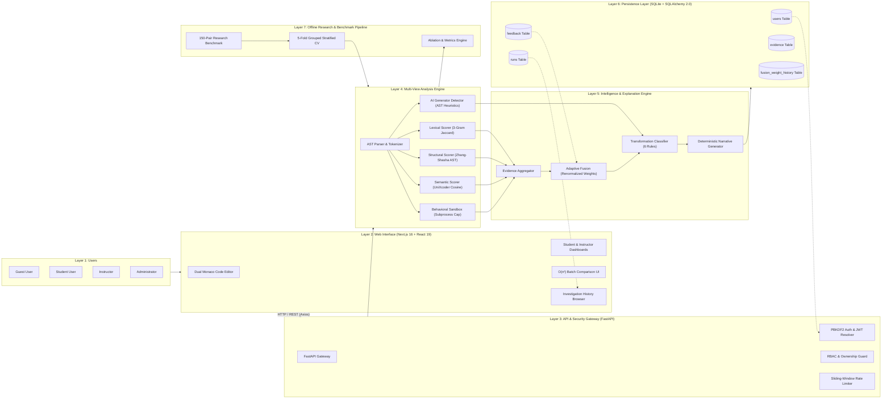
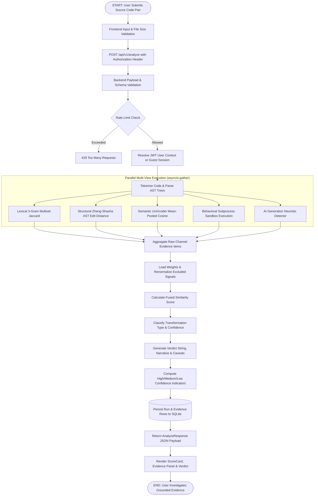
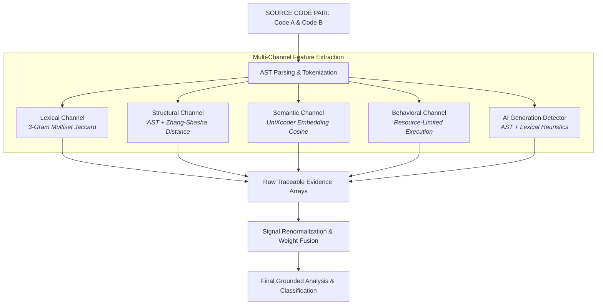
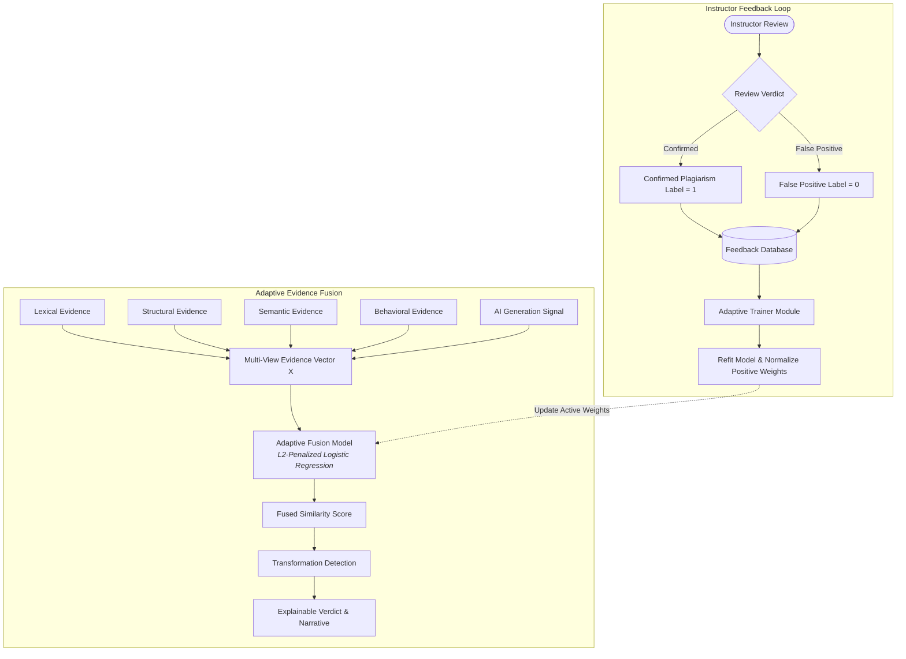
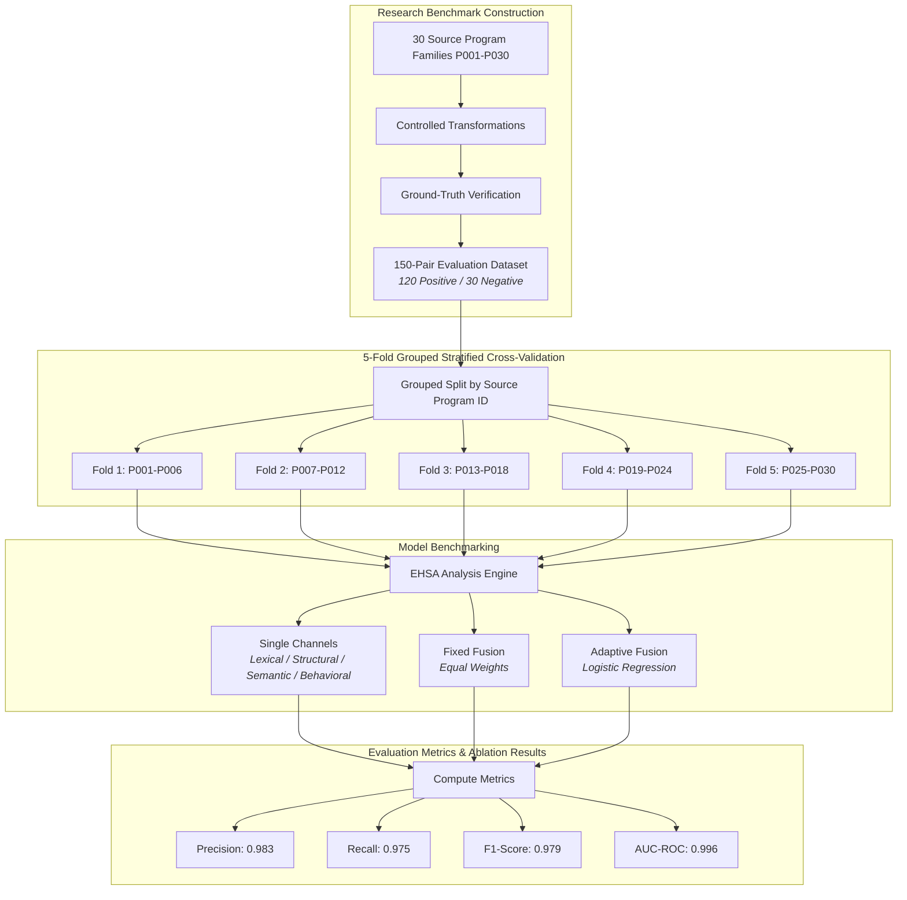
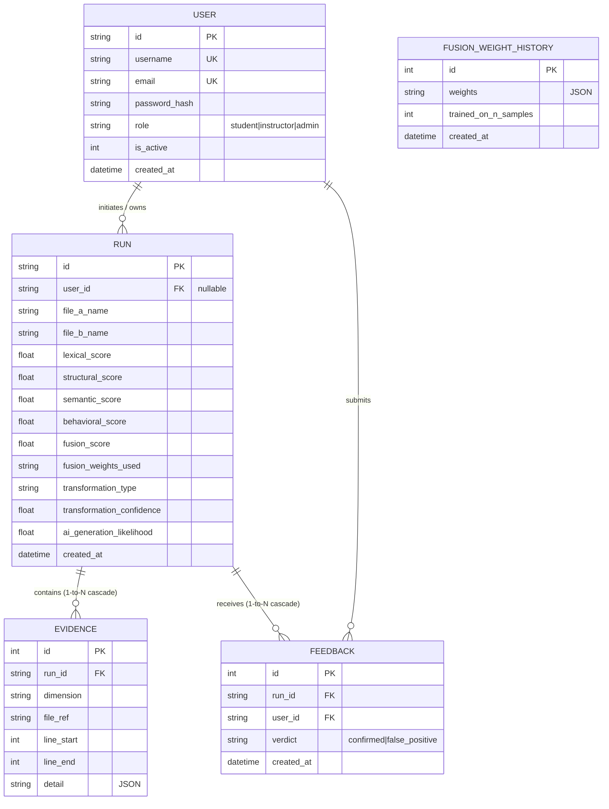
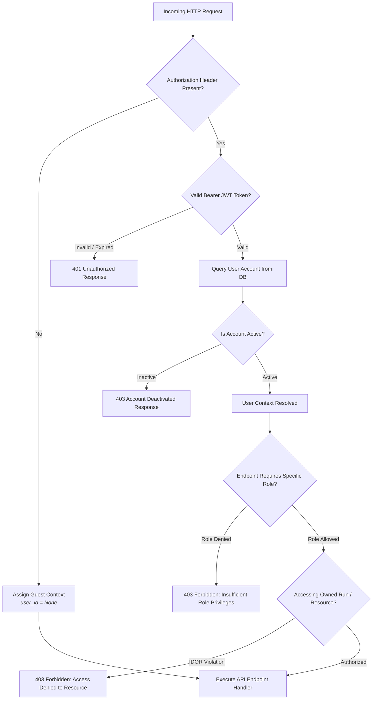
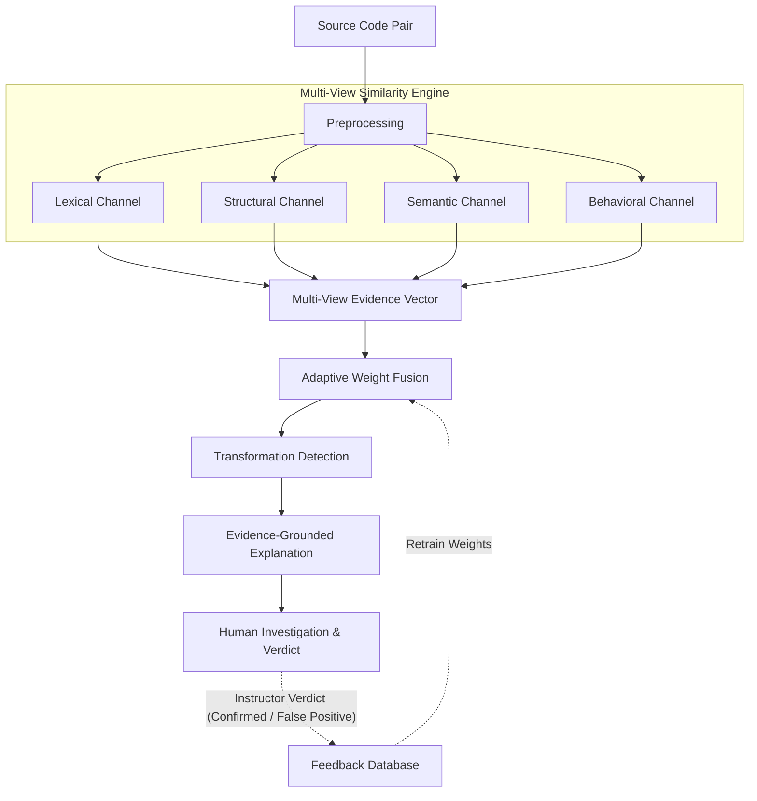
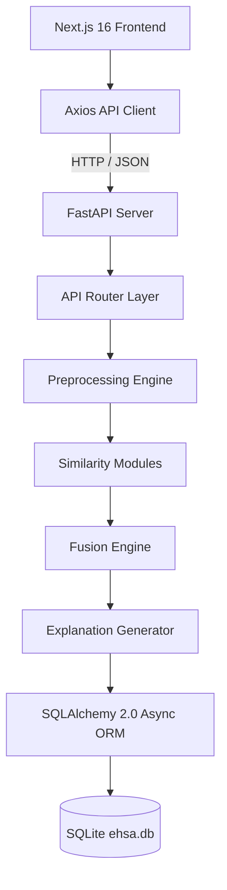

# EHSA — Research-Grade Architecture & Workflow Diagrams

This document contains the complete, publication-grade diagram set for **EHSA — Explainable Hybrid Similarity Analyzer**, designed for inclusion in research papers, the **IFGSCET-2026 conference presentation**, master/doctoral theses, live demonstrations, and technical documentation.

---

# Figure 1: EHSA High-Level System Architecture

### Suitability
- **Primary Use**: Thesis Architecture Chapter, Technical Documentation, System Overview Slide
- **Target Audience**: Conference Reviewers, System Architects, Technical Evaluators

### Explanation & Components Represented
- **Layer 1 (Users)**: Guest, Student, Instructor, and Admin roles interacting via explicit permissions.
- **Layer 2 (Frontend)**: Next.js 16 App Router UI containing Monaco Editor, Dashboard, Batch matrix, and History browser.
- **Layer 3 (API & Security)**: FastAPI gateway protected by PBKDF2 authentication, JWT tokens, RBAC guards, and sliding-window rate limiting.
- **Layer 4 (Analysis Engine)**: Preprocessing, Lexical (3-gram Jaccard), Structural (Zhang-Shasha AST edit distance), Semantic (UniXcoder cosine), Behavioral sandbox (128MB/2.0s limit), and AI generation detector.
- **Layer 5 (Intelligence)**: Evidence aggregation, adaptive weight fusion, 6-category transformation classification, and deterministic explanation generation.
- **Layer 6 (Persistence)**: SQLite database (`ehsa.db`) containing `users`, `runs`, `evidence`, `feedback`, and `fusion_weight_history` tables.
- **Layer 7 (Research)**: Decoupled 150-pair benchmark evaluation pipeline running 5-fold grouped cross-validation independently from production execution.

---

# Figure 2: EHSA End-to-End Similarity Analysis Workflow

### Suitability
- **Primary Use**: Technical Documentation, Implementation Walkthrough, Developer Onboarding
- **Target Audience**: Software Engineers, Code Reviewers

### Explanation & Components Represented
Traces the runtime execution path of a pairwise analysis request from client input to database storage and visual disclosure. Demonstrates how preprocessing, parallel feature channels, weight renormalization, transformation classification, narrative generation, and confidence calculations coordinate sequentially.

---

# Figure 3: EHSA Multi-View Similarity Analysis Pipeline

### Suitability
- **Primary Use**: Research Paper Method Methodology Section, Conference Slide (Pipeline)
- **Target Audience**: Computer Science Researchers, AI & Software Engineering Reviewers

### Explanation & Components Represented
Focuses exclusively on the core multi-channel similarity engine. Highlights the five distinct extraction mechanisms (Lexical n-grams, Structural AST trees, Semantic UniXcoder embeddings, Behavioral sandboxed execution, and AI heuristic signals) feeding into raw evidence arrays prior to adaptive fusion.

---

# Figure 4: Adaptive Evidence Fusion and Instructor Feedback Loop

### Suitability
- **Primary Use**: Research Paper Contribution Section, Conference Presentation Slide
- **Target Audience**: Machine Learning Researchers, Academic Integrity Officers

### Explanation & Components Represented
Demonstrates EHSA's core research innovation: how multi-channel evidence vectors feed into an L2-penalized Logistic Regression model to compute fused scores, and how instructor verdicts (`confirmed` vs `false_positive`) enter a closed feedback loop to retrain and update active feature weights over time.

---

# Figure 5: EHSA Research Evaluation Pipeline

### Suitability
- **Primary Use**: Research Paper Experiments Section, Thesis Evaluation Chapter
- **Target Audience**: Empirical Software Engineering Researchers, Benchmark Evaluators

### Explanation & Components Represented
Visually isolates the offline experimental benchmarking pipeline. Displays dataset construction across 30 Computer Science program families, 5-Fold Grouped Stratified Cross-Validation (guaranteeing zero data leakage across folds), strategy comparison (single channel vs fixed fusion vs adaptive fusion), and benchmark performance outputs.

---

# Figure 6: EHSA Database Entity Relationship Diagram

### Suitability
- **Primary Use**: Thesis Database Chapter, Technical Documentation, System Manual
- **Target Audience**: Database Administrators, Backend Engineers

### Explanation & Components Represented
Presents the relational database schema implemented in SQLite (`ehsa.db`) via SQLAlchemy 2.0. Highlights the five core entities (`USER`, `RUN`, `EVIDENCE`, `FEEDBACK`, `FUSION_WEIGHT_HISTORY`), primary keys, foreign key constraints, and cascade relationships.

---

# Figure 7: EHSA Authentication and Authorization Flow

### Suitability
- **Primary Use**: Security Audit Report, Technical Documentation, Thesis Security Section
- **Target Audience**: Security Auditors, Compliance Officers, Backend Developers

### Explanation & Components Represented
Detail-oriented security decision flowchart tracing request authentication, JWT token signature validation, account status checks, Role-Based Access Control (RBAC) enforcement (`student`, `instructor`, `admin`), and Insecure Direct Object Reference (IDOR) resource ownership verification.

---

# Figure 8: EHSA Research-Paper Primary Architecture

### Suitability
- **Primary Use**: **IEEE / ACM Research Paper Figure 1**, Journal Paper Architecture Overview
- **Target Audience**: Paper Readers, Peer Reviewers, Conference Attendees

### Explanation & Components Represented
The primary publication figure for academic papers. Formatted specifically for IEEE/ACM single-column or double-column layouts, clearly summarizing EHSA's core paradigm: **Source-code pair $\rightarrow$ Multi-view analysis $\rightarrow$ Traceable evidence $\rightarrow$ Adaptive fusion $\rightarrow$ Transformation detection $\rightarrow$ Grounded explanation $\rightarrow$ Human investigation $\rightarrow$ Closed-loop feedback**.

---

# Figure 9: Presentation Version (Slide-Optimized Overview)

### Suitability
- **Primary Use**: **IFGSCET-2026 Presentation Slides**, Demo Opening Slide
- **Target Audience**: Conference Audience, Slide Viewer

### Explanation & Components Represented
Ultra-clean 6-block linear slide diagram designed for presentation decks. Instantly communicates the EHSA story in under 5 seconds.

---

# Figure 10: Technical Documentation Version (Implementation Topology)

### Suitability
- **Primary Use**: Developer Onboarding Guide, System Maintenance Manual
- **Target Audience**: Software Engineers, DevOps Engineers

### Explanation & Components Represented
Concise software component stack mapping the call hierarchy from Next.js UI down to SQLite database storage.

---

# Summary of Figure Suitability & Usage Matrix

| Figure | Diagram Title | Research Paper | Presentation | Thesis | Technical Docs |
| :--- | :--- | :---: | :---: | :---: | :---: |
| **Figure 1** | EHSA High-Level System Architecture | | | ⭐ | ⭐ |
| **Figure 2** | EHSA End-to-End Similarity Analysis Workflow | | | ⭐ | ⭐ |
| **Figure 3** | EHSA Multi-View Similarity Analysis Pipeline | ⭐ | ⭐ | ⭐ | |
| **Figure 4** | Adaptive Evidence Fusion & Instructor Feedback Loop | ⭐ | ⭐ | ⭐ | |
| **Figure 5** | EHSA Research Evaluation Pipeline | ⭐ | | ⭐ | |
| **Figure 6** | EHSA Database Entity Relationship Diagram | | | ⭐ | ⭐ |
| **Figure 7** | EHSA Authentication and Authorization Flow | | | ⭐ | ⭐ |
| **Figure 8** | **EHSA Research-Paper Primary Architecture** | **⭐ PRIMARY** | ⭐ | ⭐ | |
| **Figure 9** | Presentation Version (Slide-Optimized) | | **⭐ PRIMARY** | | |
| **Figure 10**| Technical Documentation Version | | | | **⭐ PRIMARY** |

