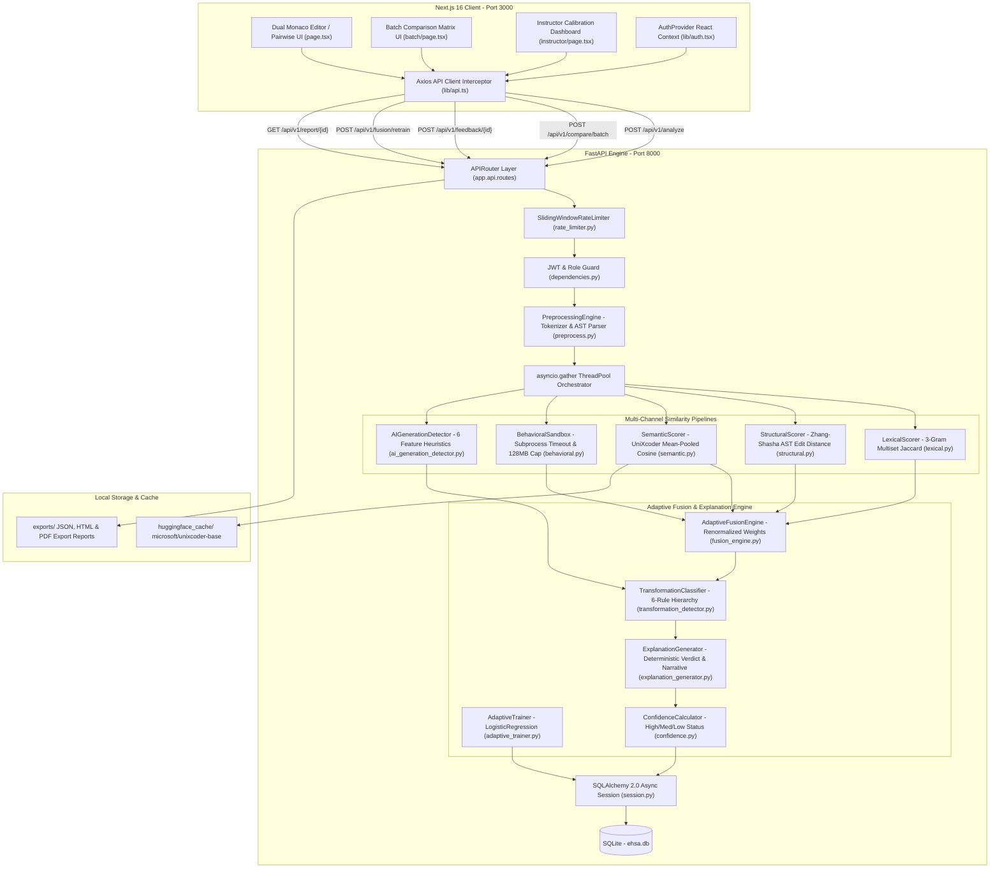
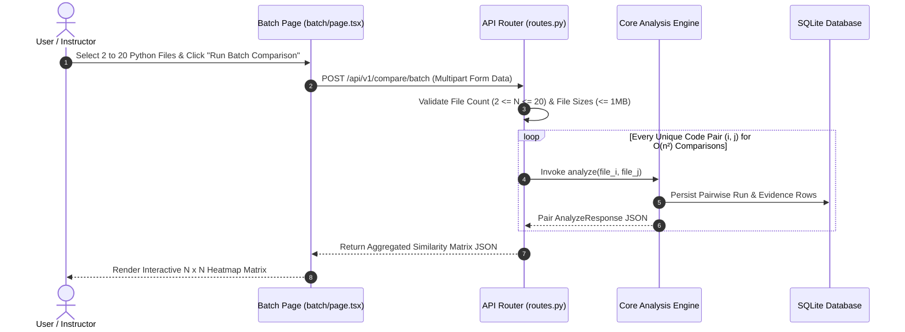
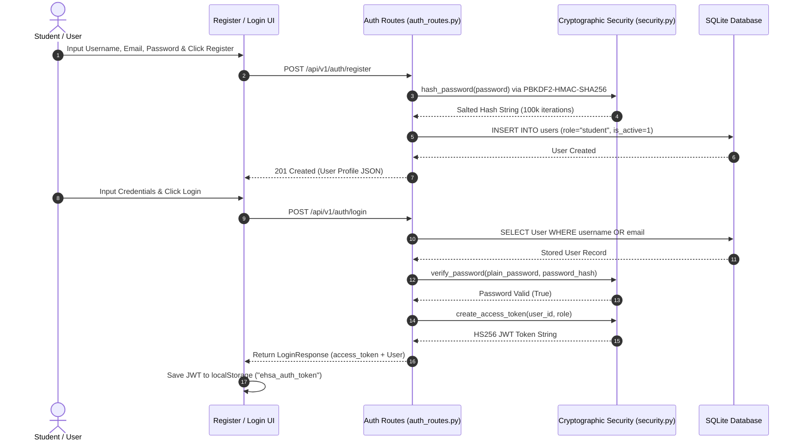

# EHSA — System Architecture & Complete Workflow Diagrams

This document contains the complete, reverse-engineered **System Architecture Diagrams** and **Sequence Workflows** for **EHSA — Explainable Hybrid Similarity Analyzer**, formatted in high-fidelity Mermaid syntax matching production architecture specifications.

---

# 1. System Block Architecture Diagram



---

# 2. Complete End-to-End Execution Sequence Diagram

```mermaid
sequenceDiagram
    autonumber
    actor User as User / Instructor
    participant FE as Next.js 16 Frontend
    participant API as FastAPI Backend (routes.py)
    participant Auth as Auth & Rate Limiter
    participant Core as Parallel Similarity Pipelines
    participant Model as PyTorch / UniXcoder Cache
    participant DB as SQLite Database (ehsa.db)

    User->>FE: Input/Paste Python Code Pair (Submission.py, Reference.py)
    FE->>API: POST /api/v1/analyze (JSON Body + Bearer JWT Header)
    
    API->>Auth: Check Sliding Window Rate Limit (max 30 req/min)
    Auth-->>API: Rate Limit OK
    API->>Auth: Resolve Authorization Bearer Token & User Context
    Auth-->>API: User Context (student/instructor/admin or guest)

    API->>Core: Preprocess Code: Tokenize (tokenize_code) & Parse AST (ast.parse)
    
    par Parallel Pipeline Execution (asyncio.gather)
        Core->>Core: 1. Lexical 3-Gram Multiset Jaccard (lexical_similarity)
        Core->>Core: 2. Structural Zhang-Shasha AST Edit Distance (structural_similarity)
        Core->>Model: 3. Semantic UniXcoder Embedding Mean-Pooling (semantic_similarity)
        Model-->>Core: Cosine Similarity Vector Float
        Core->>Core: 4. Behavioral Subprocess Sandbox Execution (2.0s timeout, 128MB cap)
        Core->>Core: 5. AI Generation Heuristic Detector (6 Features)
    end

    Core-->>API: Return Raw Channel Scores & Detailed Evidence Arrays

    API->>Core: fuse(scores, weights) — Exclude None signals & Renormalize Weights
    Core-->>API: Fused Composite Score & Weight Metadata

    API->>Core: detect_transformation(scores, ai_likelihood)
    Note over Core: Evaluate Rule Hierarchy: AI Rewrite (>=0.65) -> Exact Copy -> Renaming -> Refactoring -> Partial -> Unrelated
    Core-->>API: Transformation Type & Rule Confidence

    API->>Core: generate_explanation() & compute_confidence_indicators()
    Core-->>API: Structured Verdict, Narrative Paragraph & Confidence Status

    rect rgb(30, 41, 59)
        Note over API, DB: Async Database Transaction (SQLAlchemy 2.0)
        API->>DB: INSERT INTO runs (id, user_id, scores, transformation_type, explanation)
        API->>DB: Bulk INSERT INTO evidence (run_id, dimension, line_refs, detail JSON)
        DB-->>API: Transaction Committed
    end

    API-->>FE: Return 200 OK AnalyzeResponse JSON
    FE-->>User: Render ScoreCard Gauges, Evidence Highlights & Verdict Block

    opt Instructor Verdict Submission & Adaptive Weight Retraining
        User->>FE: Click "Confirm Plagiarism" or "False Positive"
        FE->>API: POST /api/v1/feedback/{run_id} (verdict="confirmed")
        API->>DB: INSERT INTO feedback (run_id, user_id, verdict)
        DB-->>API: Feedback Saved
        API-->>FE: 200 OK {status: "ok"}

        User->>FE: Click "Retrain Fusion Weights" (Instructor Dashboard)
        FE->>API: POST /api/v1/fusion/retrain
        API->>DB: SELECT Runs & Feedback Records
        DB-->>API: Feedback Dataset (Features X, Labels y)
        API->>Core: Fit Scikit-learn Logistic Regression Model & Normalize Positive Weights
        API->>DB: INSERT INTO fusion_weight_history (weights, trained_on_n_samples)
        DB-->>API: Weights Persisted
        API-->>FE: Return Updated Effective Weights & Historical Drift Data
    end
```



---

# 3. Batch Comparison Sequence Diagram



---

# 4. User Authentication & Authorization Sequence Diagram



---

# 5. Database ER Diagram

```mermaid
erDiagram
    users ||--o{ runs : "initiates / owns"
    users ||--o{ feedback : "submits"
    runs ||--o{ evidence : "contains (1-to-N cascade)"
    runs ||--o{ feedback : "receives (1-to-N cascade)"
    fusion_weight_history {
        int id PK
        string weights JSON
        int trained_on_n_samples
        datetime created_at
    }

    users {
        string id PK "UUID"
        string username UK
        string email UK
        string password_hash
        string role "student|instructor|admin"
        int is_active
        datetime created_at
        datetime updated_at
    }

    runs {
        string id PK "UUID"
        string user_id FK "nullable"
        string file_a_name
        string file_b_name
        float lexical_score
        float structural_score
        float semantic_score
        float behavioral_score
        float fusion_score
        string fusion_weights_used "JSON"
        string transformation_type
        float transformation_confidence
        float ai_generation_likelihood
        string explanation "JSON"
        datetime created_at
    }

    evidence {
        int id PK "autoincrement"
        string run_id FK
        string dimension
        string file_ref
        int line_start
        int line_end
        string detail "JSON"
    }

    feedback {
        int id PK "autoincrement"
        string run_id FK
        string user_id FK
        string verdict "confirmed|false_positive"
        datetime created_at
    }
```
